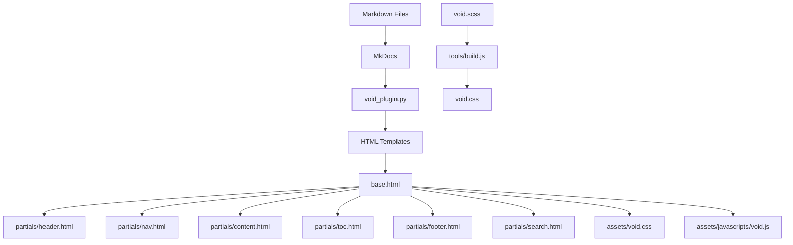

<p align="center">
  
</p>

<h1 align="center">mkdocs-void</h1>

<p align="center">
  <strong>Glass + NothingOS Design Language for MkDocs</strong>
</p>

<p align="center">
  
  
  
  
  
  
</p>

---

## Overview

Void is a custom MkDocs theme that blends the translucent, layered aesthetics of Glass design system with the minimal, industrial clarity of NothingOS. It combines pure black canvas, glass morphism panels, dot-matrix typography, and Nothing Red accents into a cohesive documentation experience.

## GitHub Statistics

<p align="center">
  
  
  
  
  
  
</p>

Live repository metrics for `rkriad585/mkdocs-void`, mirrored on both GitHub and PyPI.

## Screenshot

<p align="center">
  
</p>

<p align="center">
  <em>More screenshots: <a href="https://github.com/rkriad585/mkdocs-void/blob/main/docs/screenshots.md">View all screenshots</a></em>
</p>

---

## Table of Contents

- [Key Features](#key-features)
- [GitHub Statistics](#github-statistics)
- [Installation](#installation)
- [Quick Start](#quick-start)
- [Configuration](#configuration)
- [Usage Examples](#usage-examples)
- [Documentation](#documentation)
- [Interface](#interface)
- [Architecture](#architecture)
- [Requirements](#requirements)
- [Prerequisites](#prerequisites)
- [Development](#development)
- [Community](#community)
- [Acknowledgments](#acknowledgments)

---

## Key Features

- **Glass Morphism** — Translucent glass panels with `backdrop-filter` blur and configurable intensity (light / medium / heavy)
- **NothingOS Canvas** — Pure black (#000000) background with monochrome palette and Nothing Red (#ff3030) accents
- **Dot-Matrix Overlay** — Subtle dot pattern texture inspired by NothingOS
- **Dark & Light Modes** — Toggle between slate (dark) and default (light) color schemes
- **Typography** — Space Grotesk for display/body, Space Mono for code/labels via Google Fonts
- **Responsive Layout** — Sidebar navigation, sticky header, and mobile-friendly drawer
- **Table of Contents** — Auto-generated TOC with active section tracking
- **Full-Screen Search** — Instant search with keyboard shortcut (`/`) and result highlighting
- **Code Blocks** — Syntax highlighting with one-click copy button
- **Admonitions** — Styled note, warning, tip, and danger callouts
- **Tabbed Content** — Alternating-style tabs for grouped content
- **Task Lists** — Interactive checkbox lists
- **Reading Progress Bar** — Visual indicator of scroll position
- **Back-to-Top Button** — Appears on scroll for quick navigation
- **Page Feedback** — "Was this page helpful?" widget that opens a prefilled GitHub issue (no analytics, no tracking)
- **Announcement Bar** — Dismissable one-line banner above the header, remembered per site
- **Privacy-First Cookie Consent** — Banner appears only when a real integration is configured; a single accept/decline flag, nothing tracked
- **Opt-in Comments (giscus)** — Consent-gated comments with palette-synced theme
- **Keyboard Navigation** — Shortcuts for search (`/`), help (`?`), and close (`Esc`)
- **Reduced Motion Support** — Animations disabled when `prefers-reduced-motion` is active
- **SCSS Build Pipeline** — Sass compilation with PostCSS autoprefixer and cssnano minification

---

## Installation

```bash
pip install mkdocs-void
```

This installs both the Void theme and the companion MkDocs plugin automatically.

---

## Quick Start

1. Install the package:

   ```bash
   pip install mkdocs-void
   ```

2. Create a new MkDocs project:

   ```bash
   mkdocs new my-docs
   cd my-docs
   ```

3. Set the theme in `mkdocs.yml`:

   ```yaml
   site_name: My Docs
   theme:
     name: void
   ```

4. Start the dev server:

   ```bash
   mkdocs serve
   ```

5. Open [http://127.0.0.1:8000](http://127.0.0.1:8000) in your browser.

---

## Configuration

### Minimal

```yaml
theme:
  name: void
```

### Full

```yaml
theme:
  name: void
  favicon: assets/images/favicon.svg
  language: en
  palette:
    - scheme: slate
      primary: black
      accent: red
      toggle:
        name: Switch to light mode
    - scheme: default
      primary: white
      accent: red
      toggle:
        name: Switch to dark mode
  font:
    text: Space Grotesk
    code: Space Mono
  features:            # Material-compatible passthrough (always-on, no gating)
    - navigation.sections
    - navigation.top
    - navigation.footer
    - content.code.copy
    - search.suggest
    - search.highlight
  void:
    glass: medium
    dot_matrix: true
    animation: normal
    border: thin

plugins:
  - search
  - void
```

### Theme Options

| Option | Values | Default | Description |
|--------|--------|---------|-------------|
| `void.glass` | `"light"`, `"medium"`, `"heavy"` | `"medium"` | Glass panel blur intensity |
| `void.dot_matrix` | `true`, `false` | `true` | Dot-matrix background pattern |
| `void.animation` | `"normal"`, `"none"` | `"normal"` | Entrance and hover animations |
| `void.border` | `"thin"`, `"thick"`, `"none"` | `"thin"` | Glass panel border style |

---

## Usage Examples

### Admonitions

```markdown
!!! note "Glass Note"
    This is a styled admonition with the Void design.

!!! warning "Accent Warning"
    This uses the Nothing Red accent color.

!!! tip "Pro Tip"
    Glass effects adapt to your color scheme choice.
```

### Code Blocks

````markdown
```python
def hello():
    print("Hello from Void")
```
````

### Tabs

```markdown
=== "Python"

    ```python
    pip install mkdocs-void
    ```

=== "Node.js"

    Not applicable — Void is a Python package.
```

### Task Lists

```markdown
- [x] Install Void
- [x] Configure mkdocs.yml
- [ ] Deploy documentation
```

---

## Documentation

| Page | Description |
|------|-------------|
| [Getting Started](https://github.com/rkriad585/mkdocs-void/blob/main/docs/getting-started/installation.md) | Installation and setup guide |
| [Configuration](https://github.com/rkriad585/mkdocs-void/blob/main/docs/getting-started/configuration.md) | Full theme configuration reference |
| [Design System Overview](https://github.com/rkriad585/mkdocs-void/blob/main/docs/design/overview.md) | How the design language works |
| [Colors](https://github.com/rkriad585/mkdocs-void/blob/main/docs/design/colors.md) | Color tokens and palette reference |
| [Typography](https://github.com/rkriad585/mkdocs-void/blob/main/docs/design/typography.md) | Font system and type scale |
| [Glass Effects](https://github.com/rkriad585/mkdocs-void/blob/main/docs/design/glass.md) | Glass morphism implementation details |
| [Buttons](https://github.com/rkriad585/mkdocs-void/blob/main/docs/components/buttons.md) | Button component variants |
| [Cards](https://github.com/rkriad585/mkdocs-void/blob/main/docs/components/cards.md) | Card component with glass effects |
| [Forms](https://github.com/rkriad585/mkdocs-void/blob/main/docs/components/forms.md) | Form elements and validation |
| [Void Plugin](https://github.com/rkriad585/mkdocs-void/blob/main/docs/plugins/void.md) | Plugin configuration and options |
| [Architecture](https://github.com/rkriad585/mkdocs-void/blob/main/docs/architecture.md) | Project structure and internals |
| [Development](https://github.com/rkriad585/mkdocs-void/blob/main/docs/development.md) | Contributing and dev workflow |
| [Deployment](https://github.com/rkriad585/mkdocs-void/blob/main/docs/deployment.md) | Build and deployment guide |
| [Troubleshooting](https://github.com/rkriad585/mkdocs-void/blob/main/docs/troubleshooting.md) | Common issues and fixes |
| [Benchmarks](https://github.com/rkriad585/mkdocs-void/blob/main/docs/benchmarks.md) | CI-regenerated page-weight + Lighthouse receipts |
| [FAQ](https://github.com/rkriad585/mkdocs-void/blob/main/docs/faq.md) | Frequently asked questions |
| [Screenshots](https://github.com/rkriad585/mkdocs-void/blob/main/docs/screenshots.md) | Visual gallery of the theme |
| [About](https://github.com/rkriad585/mkdocs-void/blob/main/docs/about.md) | Credits and license |

---

## Interface

Void is a **MkDocs theme** — it provides HTML templates, CSS, and JavaScript that render your Markdown documentation as a styled website.

### Header

- Logo and site name (left)
- Hamburger menu toggle (mobile)
- Dark/light mode toggle
- Search button
- Repository link

### Sidebar

- Collapsible navigation tree with section grouping
- Active page highlighting
- Toggle buttons for expanding/collapsing sections

### Content

- Markdown content with typeset typography
- Code blocks with syntax highlighting and copy button
- Admonitions, tabs, tables, task lists
- Table of contents (right side on wide screens)

### Keyboard Shortcuts

| Key | Action |
|-----|--------|
| `/` | Open search |
| `?` | Show keyboard shortcuts |
| `Esc` | Close overlay |

---

## Architecture

```tree
mkdocs-void/
├── void/                          # Python package
│   ├── __init__.py                  # Version (0.1.2)
│   ├── plugins/
│   │   └── void_plugin.py         # MkDocs plugin (theme defaults)
│   ├── templates/
│   │   ├── base.html                # Root HTML template
│   │   ├── main.html                # Content wrapper
│   │   ├── 404.html                 # Error page
│   │   ├── mkdocs_theme.yml         # Theme registration
│   │   ├── partials/
│   │   │   ├── header.html          # Sticky header
│   │   │   ├── nav.html             # Sidebar navigation
│   │   │   ├── content.html         # Content renderer
│   │   │   ├── toc.html             # Table of contents
│   │   │   ├── footer.html          # Prev/next + copyright
│   │   │   ├── palette.html         # Dark/light toggle
│   │   │   ├── search.html          # Search modal
│   │   │   ├── progress.html        # Reading progress bar
│   │   │   └── javascripts/
│   │   │       └── palette.html     # FOUC prevention script
│   │   └── assets/
│   │       ├── void.css           # Compiled CSS
│   │       ├── stylesheets/
│   │       │   ├── void.scss      # Design tokens + base
│   │       │   └── components.scss  # Component styles
│   │       ├── javascripts/
│   │       │   └── void.js        # Theme JS (vanilla ES6+)
│   │       └── images/
│   │           ├── logo.svg         # Theme logo
│   │           └── favicon.svg      # Browser favicon
│   ├── extensions/                  # Reserved for future use
│   └── utilities/                   # Reserved for future use
├── docs/                            # Documentation source
├── logo/
│   └── logo.svg                     # Project logo (512x512)
├── tools/
│   ├── build.js                     # SCSS build pipeline
│   └── screenshots_gen.py           # Screenshot generator
├── Screenshots/                     # Generated screenshots
├── mkdocs.yml                       # MkDocs configuration
├── pyproject.toml                   # Python package config
├── package.json                     # Node.js dependencies
└── requirements.txt                 # Python dependencies
```

### Data Flow



### CSS Architecture

The stylesheet is organized in layers:

1. **Design Tokens** (`void.scss` `:root`) — CSS custom properties for colors, spacing, typography, glass, shadows, z-index, animations
2. **Light Mode Overrides** (`[data-md-color-scheme="default"]`) — Token overrides for light theme
3. **Glass Intensity Variants** — Light/medium/heavy glass via `data-md-void-glass` attribute
4. **Base Resets** — Box-sizing, font smoothing, reduced motion
5. **Dot Matrix Overlay** — Radial gradient pattern
6. **Glass Components** — `.void-glass`, `.void-card`
7. **Typography** — Display, labels, body, code
8. **Components** (`components.scss`) — Layout, header, nav, content, TOC, footer, search, tabs, admonitions, code blocks, tables, and more

---

## Requirements

- **Python** 3.8 or higher
- **MkDocs** 1.5 or higher
- **Node.js** 18 or higher (for building CSS)
- A modern browser with support for `backdrop-filter`

---

## Prerequisites

- `pip` (Python package manager)
- `npm` (Node.js package manager)
- A text editor or IDE

---

## Development

### Clone and Install

```bash
git clone https://github.com/rkriad585/mkdocs-void.git
cd mkdocs-void
pip install -e .
npm install
```

### Build CSS

```bash
npm run build
```

### Watch Mode

```bash
npm run start
```

### Dev Mode

```bash
npm run dev
```

### Serve Documentation

```bash
mkdocs serve
```

### Lint

```bash
ruff check void/
```

### Clean

```bash
rm -rf site/ dist/ build/ *.egg-info .ruff_cache/
find . -type d -name __pycache__ -exec rm -rf {} +
```

Or use Make:

```bash
make install    # Install dependencies
make build      # Build CSS
make dev        # Dev mode
make serve      # Serve docs
make lint       # Run linter
make clean      # Remove build artifacts
make help       # Show all commands
```

---

## Community

- **Discussions** — ask questions and share showsites at
  [github.com/rkriad585/mkdocs-void/discussions](https://github.com/rkriad585/mkdocs-void/discussions)
- **Good first issues** — browse
  [issues labeled `good first issue`](https://github.com/rkriad585/mkdocs-void/issues?q=is%3Aissue+is%3Aopen+label%3A%22good+first+issue%22)
  to start contributing
- **Translations** — see the [Translating Void](https://github.com/rkriad585/mkdocs-void/blob/main/docs/identity.md#translating-void) guide
- **Sponsor** — fund development via [GitHub Sponsors](https://github.com/sponsors/rkriad585) or [Open Collective](https://opencollective.com/rkriad585)

---

## Acknowledgments

- [MkDocs](https://www.mkdocs.org/) — the static site generator this theme is built for
- [Space Grotesk](https://fonts.google.com/specimen/Space+Grotesk) and [Space Mono](https://fonts.google.com/specimen/Space+Mono) — the typefaces used throughout the theme
- Nothing Technology — for the NothingOS design identity

---

<div align="center">

**Developed with ♥ by [rkriad585](https://github.com/rkriad585)**

*Make documentation feel app-like — fast, private, distinctive.*

[GitHub](https://github.com/rkriad585/mkdocs-void) · [Docs](https://rkriad585.github.io/mkdocs-void) · [Changelog](https://github.com/rkriad585/mkdocs-void/blob/main/CHANGELOG.md) · [Discussions](https://github.com/rkriad585/mkdocs-void/discussions)

</div>
