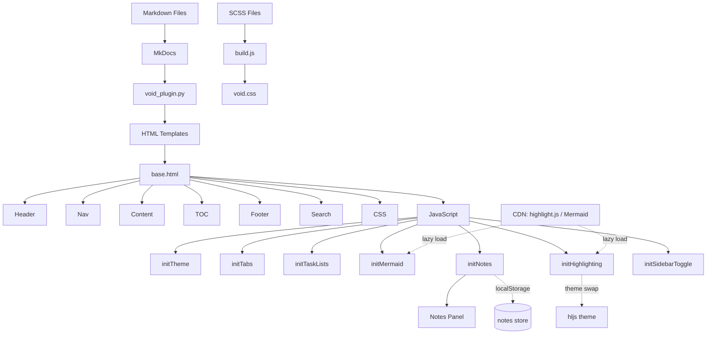

# Architecture

This page describes the internal structure and design of mkdocs-void.

## Project Structure

```tree
mkdocs-void/
├── void/                          # Python package
│   ├── __init__.py                  # Version (0.2.2)
│   ├── plugins/
│   │   └── void_plugin.py         # MkDocs plugin
│   ├── templates/
│   │   ├── base.html                # Root HTML template
│   │   ├── main.html                # Content wrapper
│   │   ├── 404.html                 # Error page
│   │   ├── mkdocs_theme.yml         # Theme registration
│   │   ├── partials/                # Reusable HTML partials
│   │   └── assets/                  # CSS, JS, images
│   ├── extensions/                  # Reserved
│   └── utilities/                   # Reserved
├── docs/                            # Documentation source (Markdown)
├── logo/                            # Project logo
├── tools/
│   ├── build.js                     # SCSS → CSS build pipeline
│   └── screenshots_gen.py           # Screenshot generator
├── Screenshots/                     # Generated screenshots
├── mkdocs.yml                       # MkDocs site config
├── pyproject.toml                   # Python package config
├── package.json                     # Node.js dependencies
└── requirements.txt                 # Python dependencies
```

## Components

### Theme Templates

The theme is built from Jinja2 templates:

| Template | Purpose |
|----------|---------|
| `base.html` | Root HTML skeleton, loads CSS/JS, defines blocks |
| `main.html` | Extends base, wraps page content |
| `404.html` | Glass-styled error page |
| `partials/header.html` | Sticky header with logo, title, search, repo link |
| `partials/nav.html` | Sidebar navigation with recursive macro |
| `partials/content.html` | Renders `page.content` |
| `partials/toc.html` | Auto-generated table of contents |
| `partials/footer.html` | Previous/next links and copyright |
| `partials/palette.html` | Dark/light mode radio toggle |
| `partials/search.html` | Full-screen search modal |
| `partials/progress.html` | Reading progress bar |
| `partials/javascripts/palette.html` | FOUC prevention (inline early-apply) |

### Plugin

`void_plugin.py` is a lightweight MkDocs plugin that:

- Sets theme defaults (language, palette, fonts, glass options) if not configured
- Ensures the `void` key in `theme` always has all required sub-options

It hooks into `on_config` and modifies the config before templates render.

### CSS Architecture

The stylesheet is organized in layers:

1. **Design Tokens** — CSS custom properties on `:root` for colors, spacing, typography, glass, shadows, z-index, transitions
2. **Light Mode Overrides** — Token overrides scoped to `[data-md-color-scheme="default"]`
3. **Glass Intensity Variants** — `light`/`medium`/`heavy` via `[data-md-void-glass]` attribute
4. **Base Resets** — Box-sizing, font smoothing, reduced motion
5. **Dot Matrix Overlay** — Radial gradient pattern
6. **Glass Components** — `.void-glass`, `.void-card`
7. **Typography** — Display, labels, body, inline code
8. **Components** (`components.scss`) — Layout, header, nav, content area, TOC, footer, search, tabs, admonitions, code blocks, tables, scroll utilities, mobile responsive, print styles, MkDocs compatibility
   - **Tabs** — `pymdownx.tabbed` with `alternate_style`, keyboard nav (Arrow keys), localStorage persistence
   - **Task Lists** — Custom checkboxes with localStorage persistence
   - **Mermaid Diagrams** — `.void-diagram` glass card, loading spinner, error states
   - **Notes Panel** — `.void-notes-panel`, inline composer, item list, mobile bottom-sheet
   - **UI Primitives** — `.void-btn`, `.void-card`, `.void-form`

### JavaScript

`void.js` is a single vanilla ES6+ file (no dependencies) that handles:

1. **Theme initialization** — Reads saved color scheme from localStorage
2. **Color scheme toggling** — Switches `data-md-color-scheme` attribute
3. **Palette icon visibility** — Shows only the opposite scheme icon
4. **Mobile navigation** — Drawer open/close with overlay
5. **Search** — Loads search index, performs client-side search, renders results, keyboard navigation
6. **Table of contents tracking** — Intersection Observer for active section highlighting
7. **Scroll behaviors** — Header scroll-aware glass, back-to-top button, reading progress
8. **Code copy buttons** — Clipboard API with feedback
9. **Anchor link headings** — Auto-generated anchor links for headings
10. **Keyboard shortcuts** — `/` for search, `?` for help, `Esc` to close
11. **Help modal** — Displays available keyboard shortcuts
12. **Nav toggle** — Expands/collapses navigation sections via CSS class
13. **`initTabs`** — Keyboard navigation (Arrow keys), `aria-selected` toggling, localStorage tab persistence
14. **`initTaskLists`** — Checkbox change → localStorage save, restore checked state on load
 15. **`initHighlighting`** — highlight.js CDN loader, `hljs.highlightAll()`, theme-aware light/dark swap
 16. **`initMermaid`** — Lazy CDN loader (`mermaid@10.9.8`), themed rendering, dark/light re-render on scheme change
 17. **`initNotes`** — Inline note composer, localStorage persistence (3-day TTL), export to MD/JSON
 18. **`initSidebarToggle`** — Sidebar collapse/expand via keyboard shortcut
 19. **`initUIExamples`** — Button press feedback and form submit validation for interactive component docs; also exposes `window.voidToast`
 20. **`initMath`** — Lazy KaTeX CDN loader (`katex@0.16.9`), renders `pymdownx.arithmatex` output, strips `\(\)`/`\[\]` delimiters

### Build Pipeline

`tools/build.js` compiles SCSS to CSS:

```
void.scss → sass.compile() → postcss(autoprefixer + cssnano) → void.css
```

- `npm run build` — Production (compressed, no sourcemaps)
- `npm run dev` — Development (expanded, inline sourcemaps)
- `npm run start` — Watch mode (rebuilds on SCSS changes via chokidar)

### CDN Dependencies

| Library | Version | Purpose | Loading Strategy |
|---------|---------|---------|------------------|
| **highlight.js** | 11.9.0 | Syntax highlighting for code blocks | Lazy — fetched only when `<code>` blocks are present |
| **Mermaid.js** | 10.9.8 | Diagram rendering | Lazy — fetched only when `.void-diagram` fences are present |
| **KaTeX** | 0.16.9 | Math typesetting (`pymdownx.arithmatex`) | Lazy — fetched only when `.arithmatex`/`.math` is present |

Both are deferred and conditionally injected by their respective `init*` functions — no requests on pages without the relevant content.

### Design Token System

All visual properties are defined as CSS custom properties:

```css
:root {
  --void-ink: #000000;           /* Background */
  --void-text-primary: #ffffff;  /* Primary text */
  --void-accent: #ff3030;        /* Nothing Red */
  --void-glass-bg: rgba(255, 255, 255, 0.08);  /* Glass fill */
  --void-glass-blur: 20px;       /* Blur radius */
  --void-font-display: 'Space Grotesk';
  --void-font-mono: 'Space Mono';
  /* ... */
}
```
Override any token in a custom stylesheet to theme the entire site without touching component code.
## Data Flow

---
[Back to README](index.md)
