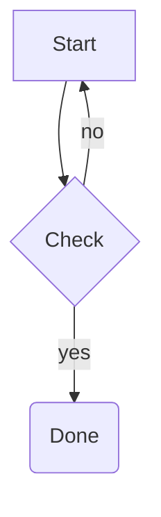
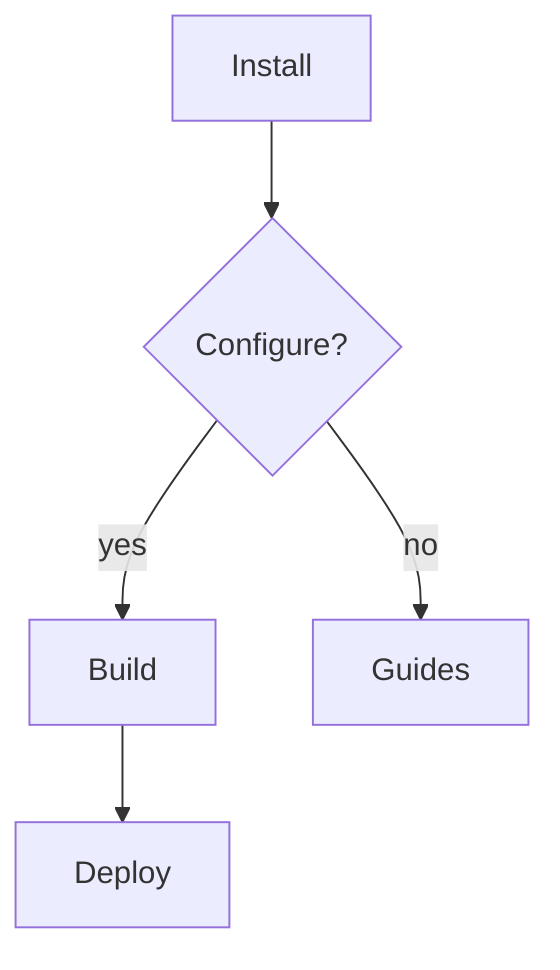
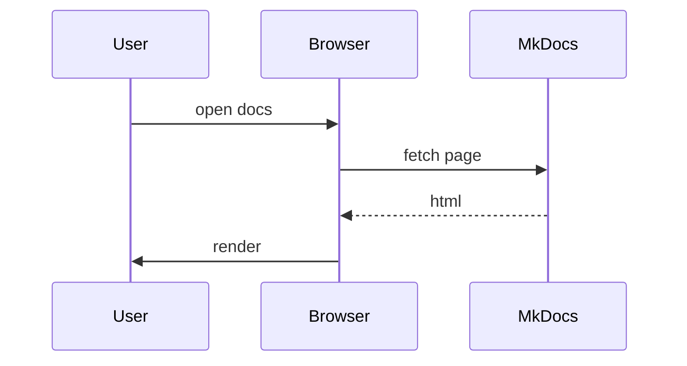
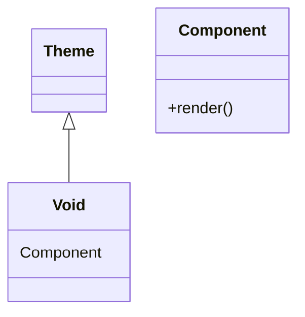
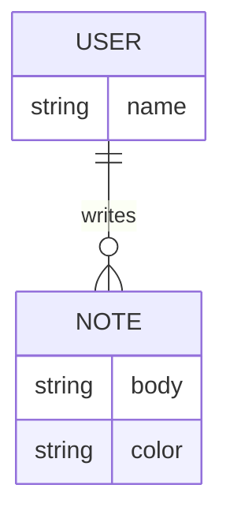
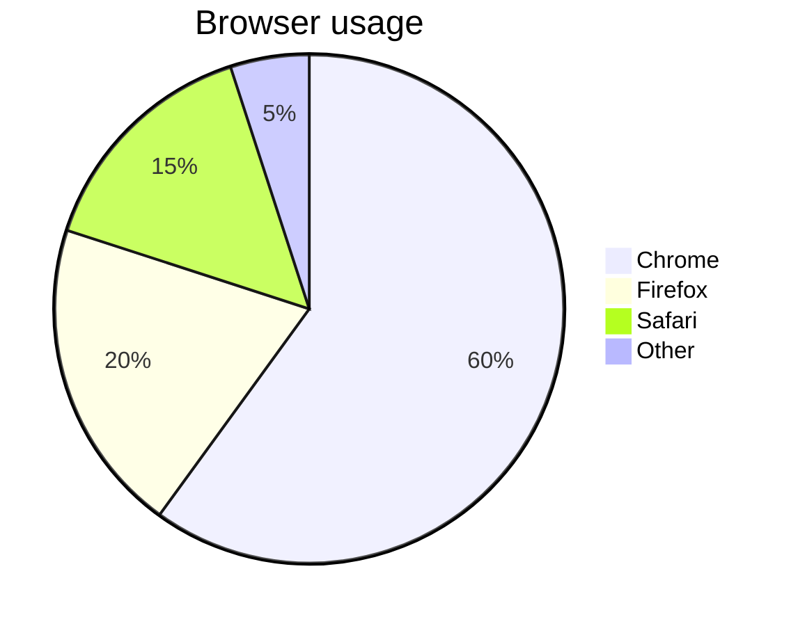

# Diagrams (Mermaid)

## What it is

Void renders fenced `mermaid` blocks through [Mermaid.js](https://mermaid.js.org)
loaded from a CDN. Diagrams are themed to match your light/dark palette and
draw inside a glass card.

## When to use it

Use Mermaid for flowcharts, sequences, class and entity diagrams, and simple
pie charts that stay maintainable as text. Keep diagrams small and focused;
for large architecture diagrams a committed SVG image is often a better fit.

## In Markdown

Wrap Mermaid source in a `mermaid` fenced block:

````markdown

````

### Flowchart



### Sequence diagram



### Class diagram



### ER diagram



### Pie chart



## Configuration

The `mermaid` fence is enabled in `mkdocs.yml`:

```yaml
- pymdownx.superfences:
    custom_fences:
      - name: mermaid
        class: mermaid
        format: !!python/name:pymdownx.superfences.fence_code_format
```

Component toggle:

```yaml
theme:
  void:
    components:
      mermaid:
        show: true        # default true
        cdn_url: ""       # empty = theme default CDN
```

## Live preview / screenshot

The diagrams above render live — each one draws as a themed glass card. Switch
the palette (light/dark) and any diagram re-renders automatically with matching
colors.

## Under the hood

- Diagrams use the `base` Mermaid theme with token colors that track the palette.
- Mermaid is only downloaded when a page actually contains a `.mermaid` block,
  so pages without diagrams never fetch the library.

## Accessibility notes

- Mermaid's SVG output is keyboard-focusable when it contains interactive
  nodes; ensure the surrounding text explains the diagram for users who can't
  see it.
- Keep diagram text large enough to remain legible, and prefer simple node
  labels over color alone to convey state.