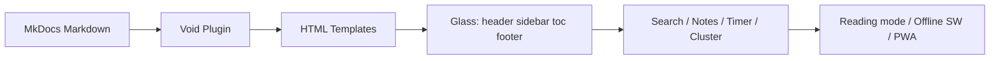

<p align="center">
  
</p>

# Welcome to Void

<p align="center">
  <strong>Glass + NothingOS Design Language for MkDocs</strong>
</p>

Void blends the translucent depth of **Glass** with the industrial minimalism of
**NothingOS** to create documentation that feels like an app — distinctive by
default, fast, and privacy-first. Everything is driven from a single
`mkdocs.yml`; no custom CSS required to look intentional.

---

## Design Principles

Void is built on five principles that ship on every page, every component, and
every color by default.

### 1. Depth through transparency

Layer communicate hierarchy. Content sits behind glass; glass sits behind the
canvas. The theme deliberately replaces drop shadows with translucency and blur
as its primary depth cue, so panels float *into* the page rather than *over*
it.

- **Glass surfaces** (`backdrop-filter: blur()` + semi-transparent fills) sit on
  top of the pure-black canvas and read differently at three intensities.
- **Layering order is fixed:** canvas → dot-matrix → content → glass panels →
  header/sidebar/TOC rails → floating chrome (action cluster, back-to-top,
  toasts, overlays).
- **No decoration without a job** — every blur, border, and opacity value is a
  design token you can override.

| Intensity | Blur | Feel |
|---|---|---|
| `light` | subtle | Content stays almost fully crisp |
| `medium` *(default)* | balanced | Frosted panels that still reveal motion behind |
| `heavy` | strong | Deep frosted-glass, high separation |

!!! tip "Backdrop support"
    `backdrop-filter` needs a modern Chromium, Firefox, or Safari/WebKit engine.
    On browsers without it the glass falls back to a flat semi-transparent
    panel — the layout and hierarchy survive unchanged.

### 2. Restraint over decoration

Every visual element earns its place. There is a dot matrix, not a pattern
library; one accent color, not a palette marketing deck; one pair of fonts, not
a type romance.

- **Pure black canvas** — the NothingOS signature. `--void-ink: #000000`.
- **Monochrome hierarchy** — white → muted grays → Nothing Red. Structure is
  carried by tone, not by rainbow.
- **Nothing Red (`#ff3030`)** is the *only* signal color: active nav, links,
  progress, focus, and accents. If it is red, it is interactive.
- **Dot-matrix overlay** (`void.dot_matrix`) adds the NothingOS texture as a
  fixed, non-intrusive layer behind every surface.

### 3. Functional color

Color is never decorative alone — it encodes meaning.

- **Accent** = actionable (links, active state, focus ring, progress).
- **Tone** = structure (text primary → secondary → muted, borders).
- **Scheme** = context: `slate` (dark, default) and `default` (light) are
  swapped by the palette toggle in the header.
- **Selection & scrollbar** are themed tokens too, so even the "invisible"
  chrome matches your brand.

### 4. Typographic clarity

One geometric sans for display and body, one monospace for code and metadata
labels — no mixing, no third typeface.

- **Space Grotesk** — headings, body, UI (via `theme.font.text`).
- **Space Mono** — code, inline code, uppercase label chips (via
  `theme.font.code`).
- Every size, weight, leading, and letter-spacing is a token
  (`theme.void.typography.*`), from `font_size_base` to `heading_letter_spacing`.

### 5. Motion with restraint

Animation exists to orient, never to distract — and it honors the operating
system.

- **Entrance & hover** animations + **scroll** progressives, all tagged to the
  `animation` token (`normal` | `reduced` | `none`).
- **`prefers-reduced-motion`** automatically disables animations for users who
  ask for it.
- The **reading progress bar** and **scrollspy TOC** give the page a sensed,
  physical presence without screens that chase the cursor.



---

## Features

Everything below ships **enabled by default** — switch it, don't rebuild it.
Over 200 config keys under `theme.void.*` tune behavior without touching code.

### Visual system

| Feature | What you get |
|---|---|
| **Glass morphism** | `glass: light / medium / heavy` — configurable blur, saturation, opacity |
| **NothingOS canvas** | Pure black `#000000` background, dot-matrix overlay (`dot_matrix`) |
| **Dark & Light modes** | `palette:` toggle between `slate` and `default` schemes |
| **Typography** | Space Grotesk + Space Mono via Google Fonts, fully token-overridable |
| **Borders & shadows** | `border` width/style/color + `shadows` style per component family |
| **Scrollbar & selection** | Native-chrome theming (`scrollbar`, `selection` token groups) |
| **Animations** | Page transitions, hover effects, scroll progressives, reduced-motion aware |

### Layout & navigation

- **Sticky glass header** — frosted rail with logo, site name, page title, and
  configurable right-side actions (`palette_toggle`, `search`, `repo_link`,
  custom links/buttons).
- **Sidebar** — glass, collapsible (`Ctrl+Shift+B`), collapsible section
  headings, active border, nested indent, `left`/`right` position swap.
- **TOC rail** — scrollspy tracking, configurable levels (h2–h6), collapsible
  (`Ctrl+Shift+T`), permalinks, `left`/`right` swap with the sidebar.
- **Breadcrumbs** — auto trail above content when ancestors exist.
- **SPA navigation** — in-page transitions with scroll restore and
  back/forward handling.
- **Reading progress** bar + floating **back-to-top** button with threshold.
- **Prev/next footer** navigation, `default | minimal | extended` footer
  layouts, social icons, custom columns.
- **Mobile drawer** — hamburger menu with a responsive, touch-friendly layout.
- **Page-level overrides** — front matter `void:` blocks (hide header/sidebar/
  TOC/footer, `glass: "heavy"`, `dot_matrix: false`, custom CSS, `layout: wide|full`).

### Content & components

Check every component page for the full recipe — here is the home-page taste:

!!! note
    Admonitions are glass callouts with per-type accent colors and optional
    titles; `details`/`pymdownx.details` folds them into collapsibles.

=== "Tabs"
    `pymdownx.tabbed` alternates grouped content — works with code blocks,
    admonitions, and task lists inside each tab.

=== "Task lists"
    `pymdownx.tasklist` renders interactive checkboxes; `persist_state` remembers
    what you ticked per page.

=== "Footnotes"
    `footnotes` disambiguates side notes[^1] without breaking reading flow.

[^1]: Footnote text renders in a clean, disambiguated note list at the foot of
      the page — marked, monospace, and searchable.

- **Code blocks** — syntax highlighting (`highlight.js`), copy button, optional
  line-number gutter and `hl_lines` emphasis.
- **Diagrams** — `mermaid` superfence with zoom/pan/fullscreen controls.
- **Math** — KaTeX via `pymdownx.arithmatex`, e.g. a glass blur radius
  $r = \frac{1}{b}$ where $b$ is blur:

  $$\text{radius} = \sqrt{{\text{blur}}^2 + {\text{saturation}}^2}$$

- **Images & SVG** — click-to-zoom **lightbox**, `lazy` loading, dark-aware
  logos via `data-md-scheme-dark/light`.
- **Tables** — responsive scroll wrapper, optional striped/bordered styles.
- **Buttons, cards, trees, toast** — component variants, glass cards, `tree`
  code blocks with dimmed comments, and a toast notification system.
- **CSS classes in markdown** — style content with utility classes
  (`{.button .primary}`, `.glass`, accent text) via `attr_list` + `md_in_html`.

### Search & discovery

- **Full-screen search modal** — instant, opened with `/`, suggestions,
  context snippets, term highlighting, and a per-result *copy link* share
  button.
- `search.suggest` + `search.highlight` passthroughs and full dialog
  customization (`search:*` keys: placeholder, min chars, max results, glass,
  breadcrumbs, icons).

### Engagement & privacy

- **Page feedback** — "Was this page helpful?" opens a prefilled GitHub issue.
  No analytics, no tracking.
- **Announcement bar** — dismissable (remembered) banner; `top|right|bottom|
  left|center` placements; non-dismissable pinned mode.
- **Cookie consent** — privacy-first: banner appears only when a real
  integration exists (`render: auto`), or `always`/`never`.
- **Opt-in giscus comments** — consent-gated GitHub Discussions threads with
  palette-synced theme.
- **"Powered by Void"** footer credit + dot-matrix badge (`void_showcase`).

### Productivity (the app layer)

- **Keyboard shortcuts** (`?` opens the help modal) — every binding is remappable:

  | Shortcut | Action |
  |---|---|
  | `/` | Open search |
  | `?` | Keyboard shortcuts help |
  | `Alt+Shift+R` | Toggle reading mode |
  | `Alt+Shift+A` | Toggle action cluster |
  | `Alt+Shift+T` | Open focus timer |
  | `Ctrl+Shift+N` | Toggle notes panel |
  | `Ctrl+Shift+B` / `Ctrl+Shift+T` | Collapse sidebar / TOC |
  | `Ctrl+Shift+L` | Cycle color scheme |
  | `Ctrl+Shift+G` | Toggle repo popover |

- **Reading mode** — distraction-free article: header, sidebars, TOC, footer,
  and progress chrome hide; the article re-measures to full width; persisted.
- **Action cluster** — floating hub (`+`) expanding into keyboard help, notes,
  focus timer, and reading mode; per-action shortcuts and badges.
- **Focus timer** — 25-minute default session in the TOC panel + a chip in
  reading mode, WebAudio chime, toast on complete, persisted across reloads.
- **Notes panel** — quick side notes with TTL expiry and export.
- **Repo popover** — hover the repo link for description, stars, forks, issues,
  language, latest commit (cached; honest about GitHub rate limits).

### Developer & extensibility

- **Generated config reference** — `tools/emit_config_reference.py` emits the
  canonical key table from the plugin's own truth.
- **Design tokens** — override any of `colors`, `typography`, `spacing`,
  `border_radius`, `transitions`, `shadows` under `theme.void.*`.
- **Component visibility toggles** — show/hide any piece (`components.*.show`)
  via config only; nothing is stripped from the theme.
- **Custom CSS/JS/head/body injection** — `custom_css`, `custom_js`,
  `extra_css`, `extra_javascript`, `void_custom_head/body_start/body_end`,
  `void_custom_html_attrs`.
- **Config builder (dev tool)** — a self-contained wizard that generates a
  `mkdocs.yml` from grouped questions (gear in the cluster; OFF by default on
  real sites).
- **AI-readable mode** — every page ships a watermarked Markdown mirror, plus
  `llms.txt` and `llms-full.txt` at the site root for agents.
- **PWA + offline** — auto `manifest.webmanifest`, service-worker caching
  (`void/templates/sw.js`), CDN/local/bundle asset modes.
- **Social cards & structured data** — per-page Article JSON-LD and a generated
  OG/Twitter card image.
- **i18n** — flat alias keys for every user-facing string (search, TOC, labels).

---

## Quick Start

```bash
pip install mkdocs-void
```

```yaml
# mkdocs.yml
theme:
  name: void
```

```bash
mkdocs serve
```

That is the whole setup: install, configure, serve, go.

---

## Example

A working page using several components at once:

!!! tip "Glass adapts to your scheme"
    The same markup renders correctly in both `slate` and `default` palettes —
    no per-scheme CSS needed.

Start with the components you reach for most:

- [x] Admonitions for callouts
- [x] Tabs for grouped content
- [x] Task lists for steps
- [x] Mermaid + KaTeX for signal
- [ ] A custom design token override

```python
from void import __version__
print(f"Void {__version__} — glass, nothing, red.")
```

---

*Void — where glass meets minimalism.*

[About](https://github.com/rkriad585/mkdocs-void/blob/main/docs/about.md) ·
[GitHub](https://github.com/rkriad585/mkdocs-void) ·
[Report an Issue](https://github.com/rkriad585/mkdocs-void/issues)

> **Docs policy:** the documentation and READMEs never link to, embed, or depend
> on planning artifacts — this
> page stands on its own.